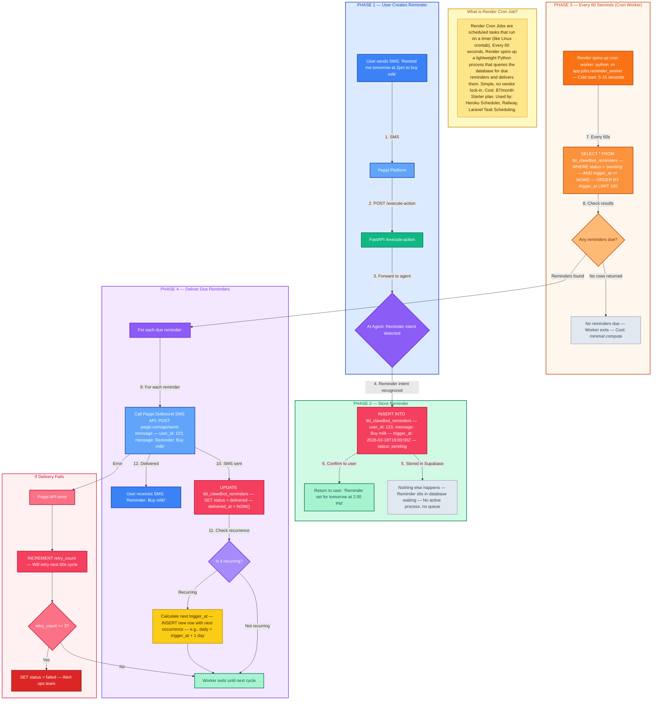
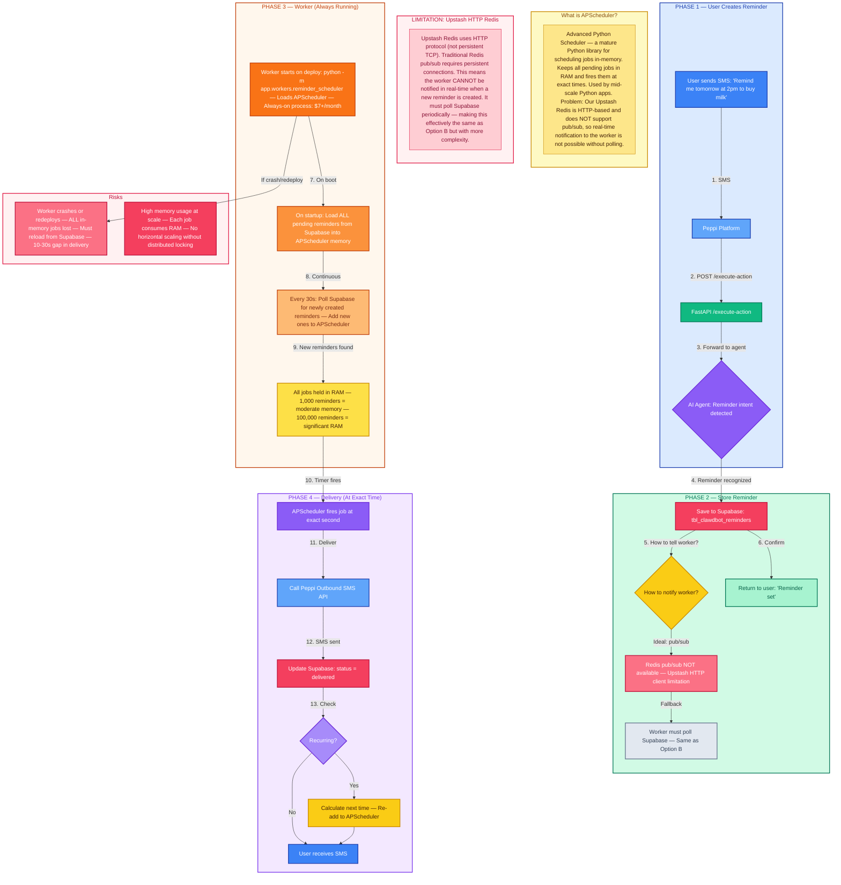
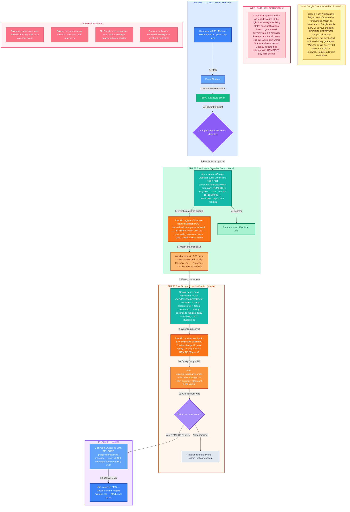

# Reminder Feature — Technical Proposal

## Moltbot Multi-Tenant Reminder & Scheduled Notification System

**Prepared for:** Peppi Engineering Team
**Date:** February 2026
**Author:** Architecture Review
**Status:** Proposal — Awaiting Decision

---

## 1. PROBLEM STATEMENT

Users frequently ask the Moltbot AI assistant to set reminders:

- *"Remind me tomorrow to bring milk"*
- *"Remind me at 2pm to buy a toy for my kid"*
- *"Remind me every Monday at 9am to submit the weekly report"*

**Current limitation:** Moltbot operates on a synchronous request-response model. The user sends an SMS, Peppi calls Moltbot, Moltbot responds immediately. There is **no mechanism to proactively send a message to a user at a future time**.

**What we need:**
1. A way to **store** reminder data (what, when, for whom, timezone)
2. A way to **trigger** reminders at the correct time
3. A way to **deliver** the reminder back to the user via SMS through Peppi
4. **Multi-tenant isolation** — each user's reminders are independent
5. **Timezone awareness** — "2pm" means 2pm in the user's local timezone
6. **Reliability** — reminders must not be lost if a service restarts

---

## 2. CURRENT STACK ANALYSIS

Before evaluating options, here is what we have today and what is missing:

### What We Have

| Component | Technology | Role |
|-----------|-----------|------|
| API Orchestrator | FastAPI (Python 3.11) | Routes, sessions, credentials, audit |
| AI Gateway | Node.js (OpenClaw + Gemini 2.5 Flash) | AI agent execution |
| Cache & State | Upstash Redis (HTTP) | Sessions, locks, rate limits |
| Persistent DB | Supabase PostgreSQL | Encrypted credentials, audit log |
| Hosting | Render.com (Pro plan) | 3 web services, 1GB disk |
| SMS Delivery | Peppi Platform (Laravel) | Sends/receives SMS to users |
| Timezone System | Full timezone pipeline | User TZ passed through all layers |

### What We DO NOT Have

| Missing Piece | Impact on Reminders |
|---------------|-------------------|
| Background workers | No process running to check "is it time yet?" |
| Cron jobs | No scheduled tasks in Render config |
| Task/message queue | No way to schedule future work |
| Outbound push to Peppi | No API to proactively send SMS to a user (only respond) |
| Reminder storage table | No database table for storing scheduled reminders |

### Critical Dependency: Peppi Outbound API

**Regardless of which option we choose**, we need Peppi (Laravel) to expose an API endpoint that Moltbot can call to proactively send an SMS to a user:

```
POST https://peppi.com/api/v1/send-message
{
    "user_id": "123",
    "message": "Reminder: Buy milk on your way home!",
    "source": "moltbot-reminder"
}
```

**This is a prerequisite for ALL options below.** Without it, no reminder system can deliver messages. The Peppi team must build this endpoint (or confirm if one already exists).

---

## 3. REMINDER DATA MODEL

All options require storing reminders. Here is the proposed schema:

### Table: `tbl_clawdbot_reminders`

| Column | Type | Description |
|--------|------|-------------|
| id | BIGSERIAL PK | Unique reminder ID |
| user_id | INTEGER NOT NULL | Owner of the reminder |
| message | TEXT NOT NULL | What to remind ("Buy milk") |
| trigger_at | TIMESTAMPTZ NOT NULL | When to fire (stored in UTC) |
| user_timezone | VARCHAR(50) | Original timezone for display |
| recurrence | VARCHAR(20) NULL | none, daily, weekly, monthly |
| recurrence_rule | JSONB NULL | For complex patterns (day of week, etc.) |
| status | VARCHAR(20) DEFAULT 'pending' | pending, delivered, failed, cancelled |
| delivered_at | TIMESTAMPTZ NULL | When actually delivered |
| created_at | TIMESTAMPTZ DEFAULT NOW() | When the user created it |
| retry_count | INTEGER DEFAULT 0 | Delivery attempt counter |
| max_retries | INTEGER DEFAULT 3 | Max delivery attempts |

**Indexes:**
- `(status, trigger_at)` — The query "find all pending reminders due now" must be fast
- `(user_id, status)` — "Show me my active reminders"
- `(trigger_at)` — Time-based range scans

This table lives in **Supabase PostgreSQL** (persistent, survives restarts, queryable).

---

## 4. OPTION A — Upstash QStash (Serverless Scheduled Messages)

### What Is It

Upstash QStash is a serverless HTTP message scheduler from the same company that provides our Redis. You schedule an HTTP request to be delivered to your endpoint at a specific future time. QStash handles the waiting, retrying, and delivery.

### How It Works

```
User: "Remind me tomorrow at 2pm to buy milk"
            |
            v
    [AI Agent recognizes reminder intent]
            |
            v
    [FastAPI saves reminder to Supabase]
            |
            v
    [FastAPI calls QStash API]
    POST https://qstash.upstash.io/v2/publish
    Headers:
        Upstash-Delay: "18h"  (or Upstash-Not-Before: unix_timestamp)
    Body:
        {reminder_id: 456, user_id: 123, message: "Buy milk"}
    Destination:
        https://moltbot-fastapi.onrender.com/api/v1/reminders/deliver
            |
            v
    [QStash holds the message for 18 hours]
            |
            v
    [At 2pm tomorrow, QStash calls our endpoint]
    POST /api/v1/reminders/deliver
        {reminder_id: 456, user_id: 123, message: "Buy milk"}
            |
            v
    [FastAPI calls Peppi outbound API]
    POST https://peppi.com/api/send-message
        {user_id: 123, message: "Reminder: Buy milk!"}
            |
            v
    [User receives SMS]
```

### Recurring Reminders

QStash supports CRON expressions natively:

```
POST https://qstash.upstash.io/v2/schedules
Headers:
    Upstash-Cron: "0 9 * * 1"  (every Monday at 9am UTC)
Body:
    {reminder_id: 789, user_id: 123, message: "Submit weekly report"}
Destination:
    https://moltbot-fastapi.onrender.com/api/v1/reminders/deliver
```

QStash will call your endpoint every Monday at 9am automatically. No background worker needed.

### Who Uses This Approach

- **Vercel** — Uses QStash for serverless cron and delayed tasks
- **Next.js applications** — Common pattern for serverless scheduled notifications
- **Startups on serverless infrastructure** — When you don't want to manage workers

### Pros

| Advantage | Detail |
|-----------|--------|
| Zero infrastructure | No background workers, no cron jobs to manage |
| Already in our ecosystem | We already pay for Upstash (Redis), QStash is the same vendor |
| Built-in retries | QStash retries failed deliveries automatically (3x with backoff) |
| Exact-time delivery | Fires at the exact scheduled time, not polling-based |
| CRON support | Native recurring schedule support |
| Signature verification | Cryptographic signing prevents unauthorized webhook calls |
| Scales to zero | Pay only when reminders fire, no idle costs |
| No code changes to Gateway | Only FastAPI needs new endpoints |

### Cons

| Disadvantage | Detail |
|-------------|--------|
| Vendor lock-in | Tied to Upstash QStash specifically |
| Cost at scale | QStash free tier: 500 messages/day. Pro: $1/100K messages. Could add up with many users |
| External dependency | If QStash is down, reminders don't fire (mitigated by their 99.99% SLA) |
| Limited visibility | Harder to debug "why didn't my reminder fire?" vs checking your own database |
| Max delay limit | Single messages can be delayed up to 7 days (use CRON schedules for longer) |
| Webhook security | Must implement signature verification to prevent spoofed reminder deliveries |

### Cost Estimate

| Tier | Messages/Day | Monthly Cost |
|------|-------------|-------------|
| Free | 500 | $0 |
| Pay-as-you-go | 100K | ~$1 |
| Pro | 500K | ~$5 |

For 1,000 users setting 2 reminders/day = 2,000 messages/day = well within pay-as-you-go tier.

### Complexity: LOW

- New code: 1 new endpoint (`/reminders/deliver`), 1 new table, QStash API calls in FastAPI
- No new services in `render.yaml`
- No new infrastructure to manage
- Estimated development: 1-2 weeks

---

## 5. OPTION B — Render Cron Job + Supabase Polling

### What Is It

Add a lightweight cron job service to Render that runs every minute, queries Supabase for reminders that are due, and delivers them by calling the Peppi outbound API.

### How It Works

```
User: "Remind me tomorrow at 2pm to buy milk"
            |
            v
    [AI Agent recognizes reminder intent]
            |
            v
    [FastAPI saves reminder to Supabase]
    INSERT INTO tbl_clawdbot_reminders
        (user_id, message, trigger_at, status)
    VALUES
        (123, "Buy milk", "2026-02-18T19:00:00Z", "pending")
            |
            v
    [Nothing happens until cron fires]

    ============================================
    EVERY 60 SECONDS — Render Cron Job runs:
    ============================================

    [Cron Worker] → SELECT * FROM tbl_clawdbot_reminders
                    WHERE status = 'pending'
                    AND trigger_at <= NOW()
                    ORDER BY trigger_at ASC
                    LIMIT 100
            |
            v
    [For each due reminder:]
        1. Call Peppi outbound API → send SMS
        2. UPDATE status = 'delivered', delivered_at = NOW()
        3. If recurring → calculate next trigger_at, INSERT new row
        4. If delivery fails → INCREMENT retry_count, retry next cycle
```

### Render Cron Job Configuration

Addition to `render.yaml`:

```yaml
services:
  - type: cron
    name: reminder-worker
    runtime: python
    region: oregon
    plan: starter          # $7/month
    schedule: "* * * * *"  # Every minute
    rootDir: fastapi-wrapper
    buildCommand: pip install -r requirements.txt
    startCommand: python -m app.jobs.reminder_worker
    envVars:
      - key: SUPABASE_URL
        sync: false
      - key: SUPABASE_KEY
        sync: false
      - key: PEPPI_OUTBOUND_URL
        sync: false
```

### Who Uses This Approach

- **Heroku Scheduler** — Heroku's built-in cron, same polling pattern
- **Railway cron jobs** — Same concept, different PaaS
- **Laravel Task Scheduling** — Peppi's own Laravel likely uses this pattern internally
- **Most SaaS startups** — Simple, proven, easy to debug

### Pros

| Advantage | Detail |
|-----------|--------|
| Simple to understand | "Check every minute, send what's due" — anyone can debug this |
| Full control | All reminder data in your own database, fully queryable |
| No vendor lock-in | Standard SQL + HTTP calls, works on any platform |
| Easy to monitor | Query `tbl_clawdbot_reminders` to see pending/delivered/failed |
| Fits existing stack | Uses Supabase (already have) + Render (already have) |
| Recurring reminders | Just calculate next `trigger_at` and insert a new row |
| Batch processing | Process 100 reminders per cycle efficiently |

### Cons

| Disadvantage | Detail |
|-------------|--------|
| Up to 60-second delay | Reminders fire within a 1-minute window, not exact second |
| Polling overhead | Queries Supabase every minute even when no reminders are due |
| Additional cost | Render cron job = Starter plan $7/month minimum |
| Cold starts | Render cron jobs spin up fresh each run (5-15s startup) |
| Clock drift | If worker takes 50s to process, next cycle starts 10s later |
| Database load | Polling query every minute, could impact other operations at scale |
| Single point of failure | If the cron job fails, reminders are delayed until next successful run |
| No sub-minute precision | Cannot schedule reminders with second-level precision |

### Cost Estimate

| Component | Monthly Cost |
|-----------|-------------|
| Render Cron (Starter) | $7 |
| Supabase (existing) | $0 additional |
| Total | $7/month |

### Complexity: LOW-MEDIUM

- New code: 1 cron worker script, 1 new table, 1 new Render service
- New infrastructure: 1 Render cron job in `render.yaml`
- Estimated development: 1-2 weeks

---

## 6. OPTION C — Dedicated Background Worker with APScheduler

### What Is It

Add a persistent background worker service on Render running Python with APScheduler (Advanced Python Scheduler). Unlike the cron polling approach, this worker stays running continuously and maintains an in-memory schedule of all pending reminders, firing them at exact times.

### How It Works

```
User: "Remind me tomorrow at 2pm to buy milk"
            |
            v
    [AI Agent recognizes reminder intent]
            |
            v
    [FastAPI saves reminder to Supabase]
    [FastAPI notifies worker via Redis pub/sub]
    PUBLISH reminder:new {reminder_id: 456, trigger_at: "2026-02-18T19:00:00Z"}
            |
            v
    ============================================
    BACKGROUND WORKER (always running):
    ============================================

    [On startup]
        1. Load all pending reminders from Supabase
        2. Schedule each one in APScheduler

    [On Redis pub/sub "reminder:new"]
        1. Fetch reminder details from Supabase
        2. Add to APScheduler's in-memory schedule

    [When APScheduler timer fires at exact time]
        1. Call Peppi outbound API → send SMS
        2. UPDATE status = 'delivered' in Supabase
        3. If recurring → calculate next, re-schedule
        4. If delivery fails → retry with backoff
```

### Render Worker Configuration

Addition to `render.yaml`:

```yaml
services:
  - type: worker
    name: reminder-scheduler
    runtime: python
    region: oregon
    plan: starter          # $7/month, always running
    rootDir: fastapi-wrapper
    buildCommand: pip install -r requirements.txt
    startCommand: python -m app.workers.reminder_scheduler
    envVars:
      - key: SUPABASE_URL
        sync: false
      - key: SUPABASE_KEY
        sync: false
      - key: UPSTASH_REDIS_URL
        sync: false
      - key: UPSTASH_REDIS_TOKEN
        sync: false
      - key: PEPPI_OUTBOUND_URL
        sync: false
```

### Who Uses This Approach

- **Celery + Beat** — Industry standard for Python (Django, Flask). Celery Beat for periodic tasks, Celery workers for execution. Used by Instagram, Mozilla, Robinhood
- **APScheduler** — Used by smaller-to-mid-scale Python applications. Simpler than Celery
- **Airflow** — Enterprise-grade (overkill for reminders, but same concept)
- **Sidekiq** — Ruby equivalent, used by GitHub, GitLab, Shopify

### Pros

| Advantage | Detail |
|-----------|--------|
| Exact-time delivery | APScheduler fires at the exact second, no polling delay |
| Real-time scheduling | New reminders are picked up instantly via pub/sub |
| Battle-tested libraries | APScheduler/Celery are mature, well-documented |
| Full control | Your code, your database, your retry logic |
| Complex scheduling | Supports cron expressions, intervals, one-off, date-based |
| Job persistence | APScheduler can use SQLAlchemy/PostgreSQL as job store (survives restarts) |
| Monitoring | Can expose health endpoints, metrics, job counts |

### Cons

| Disadvantage | Detail |
|-------------|--------|
| Always-on cost | Worker runs 24/7 even with zero reminders = $7/month minimum |
| Memory management | All scheduled jobs loaded in memory. 100K reminders = significant RAM |
| Restart recovery | On deploy/restart, must reload all pending reminders from DB |
| More moving parts | New service, pub/sub channel, worker health monitoring |
| Single worker risk | If worker crashes between restarts, reminders are delayed |
| Scaling complexity | One worker = one schedule. Multiple workers need distributed locking |
| Upstash pub/sub limitation | Upstash Redis HTTP client does not support traditional pub/sub (would need polling or alternative notification) |
| Over-engineered | For simple reminders, a full scheduler framework may be more than needed |

### Important Note: Upstash Pub/Sub Limitation

Upstash Redis is **HTTP-based** and does not support persistent pub/sub connections. This means the "notify worker via pub/sub" pattern would require either:
- **Polling Redis** for new reminders (adds latency)
- **Switching to a traditional Redis** with persistent connections (adds cost/complexity)
- **Using Upstash QStash** to notify the worker (hybrid approach)
- **Polling Supabase** periodically for new reminders (simpler, same as Option B)

This significantly reduces the advantage of Option C over Option B.

### Cost Estimate

| Component | Monthly Cost |
|-----------|-------------|
| Render Worker (Starter) | $7 |
| Additional RAM (if needed) | $0-14 |
| Supabase (existing) | $0 additional |
| Total | $7-21/month |

### Complexity: MEDIUM-HIGH

- New code: Worker service, APScheduler setup, job persistence, recovery logic
- New infrastructure: 1 Render worker service, potential Redis upgrade
- Estimated development: 2-4 weeks

---

## 7. OPTION D — Google Calendar as Reminder Engine

### What Is It

Leverage the existing Google Calendar integration to store reminders as calendar events. Use Google's Push Notifications (Webhooks) to get notified when an event is about to start, then deliver the reminder via SMS.

### How It Works

```
User: "Remind me tomorrow at 2pm to buy milk"
            |
            v
    [AI Agent recognizes reminder intent]
            |
            v
    [AI Agent creates Google Calendar event via existing skill]
    POST /calendars/primary/events
    {
        "summary": "REMINDER: Buy milk",
        "start": "2026-02-18T19:00:00Z",
        "reminders": {"useDefault": false, "overrides": [
            {"method": "popup", "minutes": 0}
        ]}
    }
            |
            v
    [FastAPI registers a Watch on user's calendar]
    POST /calendars/primary/events/watch
    {
        "id": "moltbot-watch-123",
        "type": "web_hook",
        "address": "https://moltbot-fastapi.onrender.com/api/v1/webhooks/calendar"
    }
            |
            v
    [Google sends push notification when event starts]
    POST /api/v1/webhooks/calendar
    Headers: X-Goog-Resource-Id, X-Goog-Channel-Id
            |
            v
    [FastAPI checks if event is a REMINDER type]
    [Calls Peppi outbound API → send SMS]
    [User receives: "Reminder: Buy milk!"]
```

### Who Uses This Approach

- **Google Assistant** — "Hey Google, remind me..." creates Calendar events internally
- **Apple Reminders** — Syncs with Calendar for time-based triggers
- **Zapier/IFTTT** — Calendar event triggers for automated workflows
- **Microsoft To Do** — Integrates with Outlook Calendar for reminder delivery

### Pros

| Advantage | Detail |
|-----------|--------|
| Zero new infrastructure | Uses existing Google Calendar integration, no new services |
| Already built | The "create calendar event" skill already works end-to-end |
| User-visible | Reminders appear in user's Google Calendar (extra visibility) |
| Google handles scheduling | Google's infrastructure manages the timing |
| Cross-device sync | Reminders sync to user's phone calendar app too |
| Recurring events native | Google Calendar has powerful recurrence rules (RRULE) |
| Free | No additional cost — Google Calendar API is free within quota |

### Cons

| Disadvantage | Detail |
|-------------|--------|
| Webhook complexity | Google Push Notifications require HTTPS endpoint, channel management, renewal every 7 days |
| OAuth per-user watches | Must register a Watch channel for EACH user's calendar (management overhead) |
| Notification unreliability | Google push notifications are "best effort" — not guaranteed delivery |
| Calendar clutter | User's calendar fills with "REMINDER: Buy milk" events |
| Not real-time | Google push can have delays of seconds to minutes |
| Watch expiration | Channels expire (max 30 days), must renew periodically |
| Requires calendar connected | Only works for users who connected Google account |
| Hard to distinguish | Must differentiate between real meetings and reminder-events |
| Privacy concern | User's "buy milk" reminders visible to anyone who sees their calendar |
| Domain verification | Google requires domain verification for push notification endpoints |
| Partial solution | Only works for time-based reminders, not location-based or condition-based |

### Critical Limitation: Google Push Notification Reliability

Google's Calendar push notifications documentation explicitly states:

> *"Notifications are best-effort. There is no guarantee on delivery time or that a notification will be delivered."*

For a **reminder system where the entire value is delivering at the right time**, this is a significant risk. Users will lose trust if reminders fire late or not at all.

### Cost Estimate

| Component | Monthly Cost |
|-----------|-------------|
| Google Calendar API | $0 (within free quota) |
| Infrastructure | $0 additional |
| Total | $0/month |

### Complexity: MEDIUM

- New code: Webhook endpoint, Watch registration, Watch renewal logic, event type detection
- New infrastructure: None (but significant Google API integration work)
- Estimated development: 2-3 weeks
- Ongoing maintenance: Watch channel renewals, domain verification

---

## 8. COMPARISON MATRIX

| Criteria | Option A: QStash | Option B: Cron + Polling | Option C: APScheduler Worker | Option D: Google Calendar |
|----------|:-:|:-:|:-:|:-:|
| **Delivery Precision** | Exact time | Within 60 seconds | Exact time | Seconds to minutes (unreliable) |
| **Reliability** | High (99.99% SLA) | High (depends on Render uptime) | Medium (restart = brief gap) | Low (best-effort delivery) |
| **Infrastructure Changes** | None | 1 cron job in render.yaml | 1 worker in render.yaml | None |
| **New Dependencies** | Upstash QStash SDK | None | APScheduler library | Google Push Notifications |
| **Monthly Cost** | $0-5 | $7 | $7-21 | $0 |
| **Development Time** | 1-2 weeks | 1-2 weeks | 2-4 weeks | 2-3 weeks |
| **Vendor Lock-in** | Upstash | None | None | Google |
| **Recurring Reminders** | Native CRON support | Manual calculation | Native CRON support | Native RRULE support |
| **Debugging & Visibility** | QStash dashboard | Direct SQL queries | Logs + health endpoints | Google Calendar UI |
| **Scalability** | Excellent (serverless) | Good (optimize polling) | Limited (single worker) | Excellent (Google infra) |
| **Works Without Google OAuth** | Yes | Yes | Yes | No |
| **Multi-Tenant Isolation** | Built-in (per-message) | Database-level | Database-level | Per-user calendar |
| **Max Reminders per User** | Unlimited | Unlimited | Limited by RAM | Google Calendar limits |
| **Complexity** | Low | Low-Medium | Medium-High | Medium |

---

## 9. RECOMMENDATION

### Primary Recommendation: OPTION A — Upstash QStash

**Why:**

1. **Lowest complexity** — No new services, no background workers, no cron jobs. Just API calls and a webhook endpoint. Our team can build this in 1-2 weeks.

2. **Already in our vendor ecosystem** — We pay Upstash for Redis already. QStash is the same dashboard, same billing, same support. No new vendor relationship.

3. **Exact-time delivery** — Unlike cron polling (60s window) or Google push (unreliable), QStash delivers at the exact scheduled time.

4. **True serverless** — Zero cost when no reminders are firing. Scales automatically with user growth. No idle worker burning $7/month.

5. **Built-in retry and monitoring** — QStash handles failed deliveries, retries with exponential backoff, and provides a dashboard for monitoring.

6. **Native CRON** — Recurring reminders ("every Monday at 9am") are a first-class feature, not something we have to build ourselves.

### Fallback Recommendation: OPTION B — Render Cron + Polling

**If the team prefers zero vendor lock-in**, Option B is the safest choice. It uses only technologies we already have (Supabase + Render), is easy for any developer to understand, and can be migrated to any platform. The 60-second precision window is acceptable for reminders (nobody cares if "remind me at 2pm" fires at 2:00:23pm).

### Not Recommended

- **Option C (APScheduler Worker)** — Over-engineered for our use case. The Upstash HTTP-based Redis does not support pub/sub, which eliminates the key advantage. Ends up being Option B with more complexity.

- **Option D (Google Calendar)** — Clever but unreliable. Google explicitly says push notifications are "best-effort." A reminder system that sometimes doesn't remind is worse than no reminder system. Also excludes users who haven't connected Google.

---

## 10. PREREQUISITE — Peppi Outbound SMS API

**Before any option can be implemented**, the Peppi (Laravel) team must provide or confirm:

### Required Endpoint

```
POST /api/v1/outbound/send-message

Headers:
    Authorization: Bearer {API_KEY}
    Content-Type: application/json

Body:
{
    "user_id": "123",
    "message": "Reminder: Buy milk on your way home!",
    "source": "moltbot-reminder",
    "priority": "normal"
}

Response:
{
    "status": "sent",
    "message_id": "sms_abc123",
    "delivered_at": "2026-02-18T19:00:05Z"
}
```

### Questions for Peppi Team

1. Does an outbound SMS API already exist? If yes, what is the endpoint and auth method?
2. Are there rate limits on outbound SMS? (Important for batch delivery)
3. Can we get delivery confirmation (delivered/failed/pending)?
4. Is there a webhook for delivery status updates?
5. What is the cost per outbound SMS? (Affects pricing model for reminder feature)

---

## 11. IMPLEMENTATION PHASES (For Chosen Option)

Regardless of which option is selected, implementation should follow these phases:

### Phase 1 — Foundation (Week 1)

- Create `tbl_clawdbot_reminders` table in Supabase
- Add reminder CRUD endpoints in FastAPI (create, list, cancel)
- Confirm Peppi outbound SMS API availability
- Agent skill update: teach Moltbot to recognize reminder intents

### Phase 2 — Scheduling Engine (Week 2)

- Integrate chosen scheduling mechanism (QStash / Cron / Worker)
- Build delivery endpoint that receives scheduled callbacks
- Implement retry logic for failed deliveries
- Handle timezone conversion (user local time to UTC for scheduling)

### Phase 3 — Recurring Reminders (Week 3)

- Add recurrence support (daily, weekly, monthly, custom CRON)
- Implement "next occurrence" calculation logic
- User commands: "show my reminders", "cancel reminder #3"
- Handle edge cases: DST transitions, timezone changes

### Phase 4 — Monitoring & Polish (Week 4)

- Delivery success/failure tracking in audit log
- User-facing reminder management ("list my reminders", "cancel all")
- Alert system for delivery failures (Slack/email notification to ops team)
- Load testing with simulated multi-tenant reminder load

---

## 12. QUESTIONS FOR DECISION MAKERS

1. **What is the acceptable delivery precision?** Exact second, within a minute, or within 5 minutes?
2. **Do we need recurring reminders in v1?** Or can we ship one-time reminders first?
3. **Expected scale at launch?** 100 users? 1,000? 10,000? This affects Option A vs B cost.
4. **Budget for this feature?** $0/month (Option A free tier or D) vs $7/month (Option B or C)?
5. **Vendor lock-in tolerance?** Is depending on Upstash QStash acceptable, or must we be vendor-neutral?
6. **Timeline pressure?** If we need this in 2 weeks, Options A or B. If 4 weeks is fine, any option works.

---

---

## 13. VISUAL FLOW DIAGRAMS

Use these Mermaid diagrams to visualize each option. Paste one at a time into [Excalidraw's Mermaid tool](https://excalidraw.com) to generate visual diagrams.

---

### DIAGRAM A — Upstash QStash Flow (Recommended)

```mermaid
flowchart TB
    subgraph INFO_QSTASH["What is Upstash QStash?"]
        direction TB
        QS_INFO["Serverless HTTP message scheduler by Upstash (same vendor as our Redis). You schedule an HTTP request to hit your endpoint at a future time. QStash handles the waiting, retrying, and delivery. No background workers needed. Free tier: 500 msgs/day. Pro: $1/100K msgs."]
    end

    subgraph PHASE1["PHASE 1 — User Creates Reminder"]
        direction TB
        USER["User sends SMS: 'Remind me tomorrow at 2pm to buy milk'"]
        PEPPI["Peppi Platform"]
        FASTAPI["FastAPI /execute-action"]
        AGENT{"AI Agent: Reminder intent detected"}
    end

    subgraph PHASE2["PHASE 2 — Store + Schedule"]
        direction TB
        SAVE_DB["Save reminder to Supabase: tbl_clawdbot_reminders — user_id: 123, message: Buy milk, trigger_at: 2026-02-18T19:00:00Z, status: pending"]
        QSTASH_CALL["FastAPI calls QStash API: POST qstash.upstash.io/v2/publish — Header: Upstash-Not-Before: 1740164400 — Destination: /api/v1/reminders/deliver — Body: reminder_id: 456, user_id: 123"]
        QSTASH_HOLD["QStash holds message internally — No process running on our side — Zero resource consumption while waiting"]
        CONFIRM["Return to user: 'Reminder set for tomorrow at 2:00 PM'"]
    end

    subgraph PHASE3["PHASE 3 — Delivery (18 hours later)"]
        direction TB
        QSTASH_FIRE["QStash fires at exact scheduled time: POST /api/v1/reminders/deliver — Includes signature for verification"]
        VERIFY["FastAPI verifies QStash signature — Prevents spoofed webhook calls"]
        FETCH["Fetch reminder from Supabase — Confirm status is still pending"]
        PEPPI_OUT["Call Peppi Outbound SMS API: POST peppi.com/api/send-message — user_id: 123, message: Reminder: Buy milk!"]
        UPDATE["Update Supabase: status = delivered, delivered_at = NOW()"]
        SMS["User receives SMS: 'Reminder: Buy milk!'"]
    end

    subgraph RETRY["If Delivery Fails"]
        direction TB
        FAIL["Peppi API returns error or timeout"]
        QSTASH_RETRY["QStash automatically retries — 3 attempts with exponential backoff — No code needed for retry logic"]
        FAIL_UPDATE["After max retries: status = failed, retry_count = 3"]
    end

    USER -->|"1. SMS"| PEPPI
    PEPPI -->|"2. POST /execute-action"| FASTAPI
    FASTAPI -->|"3. Forward to agent"| AGENT
    AGENT -->|"4. Reminder intent recognized"| SAVE_DB
    SAVE_DB -->|"5. Reminder stored in DB"| QSTASH_CALL
    QSTASH_CALL -->|"6. Schedule future delivery"| QSTASH_HOLD
    SAVE_DB -->|"7. Confirm to user"| CONFIRM

    QSTASH_HOLD -->|"8. Exact time reached"| QSTASH_FIRE
    QSTASH_FIRE -->|"9. Webhook arrives"| VERIFY
    VERIFY -->|"10. Signature valid"| FETCH
    FETCH -->|"11. Reminder still pending"| PEPPI_OUT
    PEPPI_OUT -->|"12. SMS sent"| UPDATE
    UPDATE -->|"13. Delivered"| SMS

    PEPPI_OUT -->|"Delivery error"| FAIL
    FAIL --> QSTASH_RETRY
    QSTASH_RETRY -->|"All retries exhausted"| FAIL_UPDATE

    %% Info box — Yellow
    style INFO_QSTASH fill:#FEF9C3,stroke:#CA8A04,color:#854D0E,stroke-width:2px
    style QS_INFO fill:#FDE68A,stroke:#CA8A04,color:#422006,stroke-width:1px

    %% Phase 1 — Blue (User side)
    style PHASE1 fill:#DBEAFE,stroke:#1E40AF,color:#1E40AF,stroke-width:2px
    style USER fill:#3B82F6,stroke:#1E40AF,color:#FFF,stroke-width:2px
    style PEPPI fill:#60A5FA,stroke:#1E40AF,color:#FFF,stroke-width:2px
    style FASTAPI fill:#10B981,stroke:#047857,color:#FFF,stroke-width:2px
    style AGENT fill:#8B5CF6,stroke:#6D28D9,color:#FFF,stroke-width:2px

    %% Phase 2 — Green (Store + Schedule)
    style PHASE2 fill:#D1FAE5,stroke:#047857,color:#047857,stroke-width:2px
    style SAVE_DB fill:#F43F5E,stroke:#BE123C,color:#FFF,stroke-width:2px
    style QSTASH_CALL fill:#F97316,stroke:#C2410C,color:#FFF,stroke-width:2px
    style QSTASH_HOLD fill:#FDBA74,stroke:#C2410C,color:#7C2D12,stroke-width:2px
    style CONFIRM fill:#A7F3D0,stroke:#047857,color:#065F46,stroke-width:2px

    %% Phase 3 — Purple (Delivery)
    style PHASE3 fill:#F3E8FF,stroke:#7C3AED,color:#7C3AED,stroke-width:2px
    style QSTASH_FIRE fill:#F97316,stroke:#C2410C,color:#FFF,stroke-width:2px
    style VERIFY fill:#FACC15,stroke:#CA8A04,color:#422006,stroke-width:2px
    style FETCH fill:#10B981,stroke:#047857,color:#FFF,stroke-width:2px
    style PEPPI_OUT fill:#60A5FA,stroke:#1E40AF,color:#FFF,stroke-width:2px
    style UPDATE fill:#F43F5E,stroke:#BE123C,color:#FFF,stroke-width:2px
    style SMS fill:#3B82F6,stroke:#1E40AF,color:#FFF,stroke-width:2px

    %% Retry — Red
    style RETRY fill:#FFF1F2,stroke:#E11D48,color:#BE123C,stroke-width:2px
    style FAIL fill:#FB7185,stroke:#BE123C,color:#FFF,stroke-width:2px
    style QSTASH_RETRY fill:#F97316,stroke:#C2410C,color:#FFF,stroke-width:2px
    style FAIL_UPDATE fill:#F43F5E,stroke:#BE123C,color:#FFF,stroke-width:2px
```



---

### DIAGRAM B — Render Cron + Supabase Polling Flow (Fallback)



---

### DIAGRAM C — APScheduler Background Worker Flow (Not Recommended)



---

### DIAGRAM D — Google Calendar as Reminder Engine Flow (Not Recommended)



---

### DIAGRAM E — Prerequisite: Peppi Outbound SMS (Required for ALL Options)

```mermaid
flowchart LR
    subgraph CURRENT["CURRENT: Request-Response Only"]
        direction TB
        C_USER["User sends SMS"]
        C_PEPPI["Peppi receives"]
        C_MOLT["Moltbot processes"]
        C_RESP["Moltbot responds"]
        C_BACK["Peppi delivers reply"]
        C_USER -->|"1"| C_PEPPI -->|"2"| C_MOLT -->|"3"| C_RESP -->|"4"| C_BACK
    end

    subgraph NEEDED["NEEDED: Outbound Push Capability"]
        direction TB
        N_TRIGGER["Reminder triggers (any option)"]
        N_MOLT["Moltbot calls Peppi API: POST /api/v1/outbound/send-message — user_id + message + source"]
        N_PEPPI["Peppi sends SMS proactively"]
        N_USER["User receives reminder — No prior SMS from user needed"]
        N_TRIGGER -->|"1"| N_MOLT -->|"2"| N_PEPPI -->|"3"| N_USER
    end

    subgraph BLOCKER["This is a PREREQUISITE"]
        direction TB
        B_INFO["Without Peppi outbound API, no reminder option works. The Peppi Laravel team must expose an endpoint that Moltbot can call to proactively send SMS. This is the single blocking dependency for the entire reminder feature."]
    end

    %% Current — Grey
    style CURRENT fill:#F1F5F9,stroke:#64748B,color:#334155,stroke-width:2px
    style C_USER fill:#94A3B8,stroke:#64748B,color:#FFF,stroke-width:2px
    style C_PEPPI fill:#94A3B8,stroke:#64748B,color:#FFF,stroke-width:2px
    style C_MOLT fill:#94A3B8,stroke:#64748B,color:#FFF,stroke-width:2px
    style C_RESP fill:#94A3B8,stroke:#64748B,color:#FFF,stroke-width:2px
    style C_BACK fill:#94A3B8,stroke:#64748B,color:#FFF,stroke-width:2px

    %% Needed — Green
    style NEEDED fill:#D1FAE5,stroke:#047857,color:#047857,stroke-width:2px
    style N_TRIGGER fill:#F97316,stroke:#C2410C,color:#FFF,stroke-width:2px
    style N_MOLT fill:#10B981,stroke:#047857,color:#FFF,stroke-width:2px
    style N_PEPPI fill:#60A5FA,stroke:#1E40AF,color:#FFF,stroke-width:2px
    style N_USER fill:#3B82F6,stroke:#1E40AF,color:#FFF,stroke-width:2px

    %% Blocker — Red
    style BLOCKER fill:#FFF1F2,stroke:#E11D48,color:#BE123C,stroke-width:2px
    style B_INFO fill:#FECDD3,stroke:#E11D48,color:#881337,stroke-width:1px
```



---

*This document is intended for internal planning and decision-making. No code has been written. The chosen option should be confirmed before development begins.*
