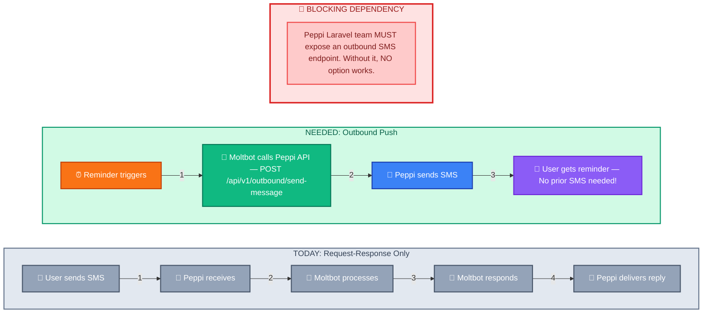
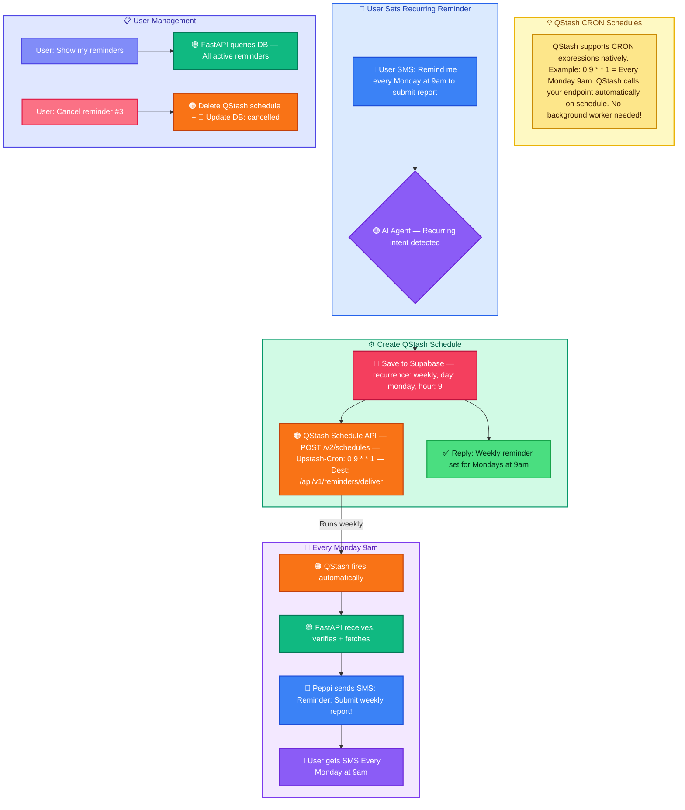
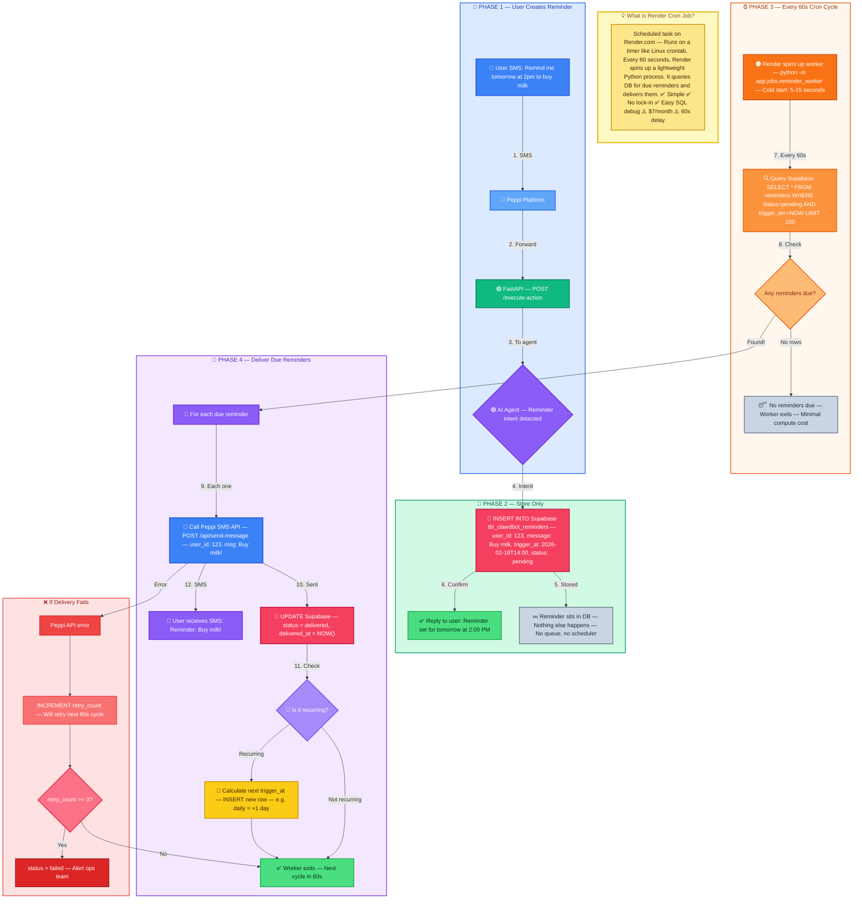
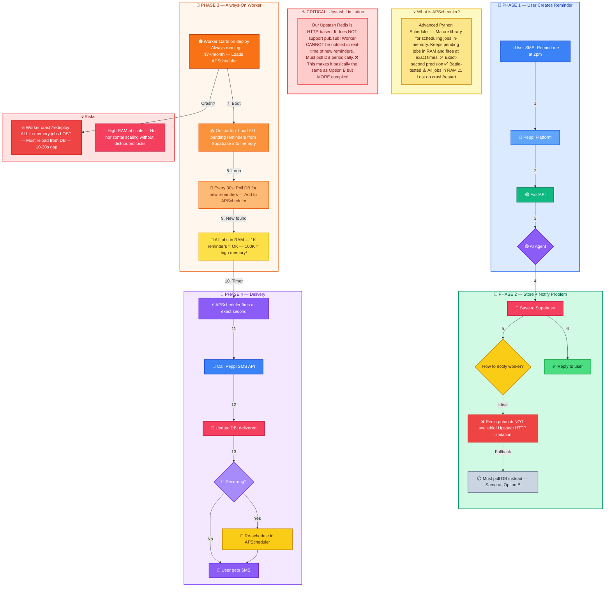
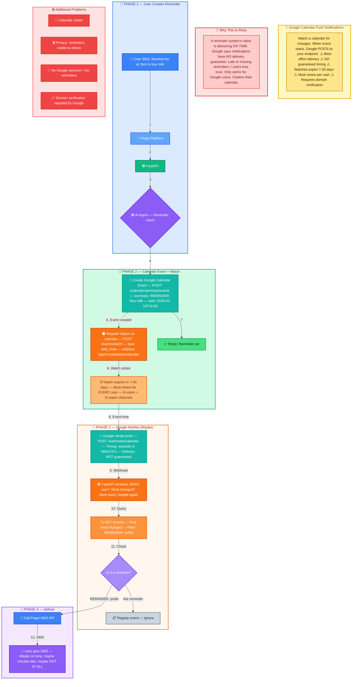
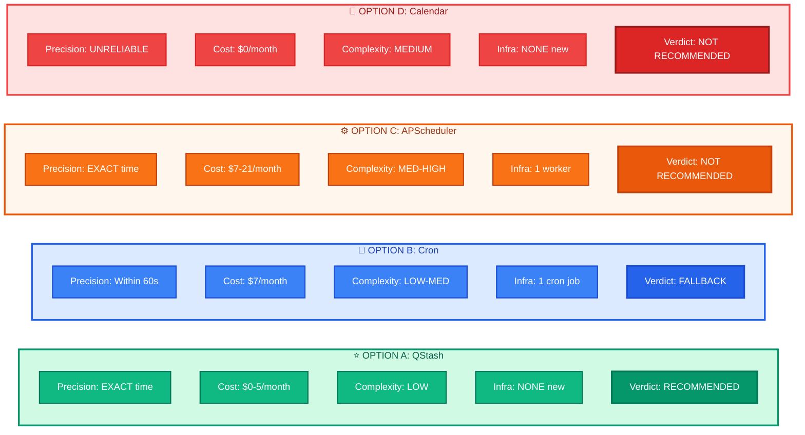
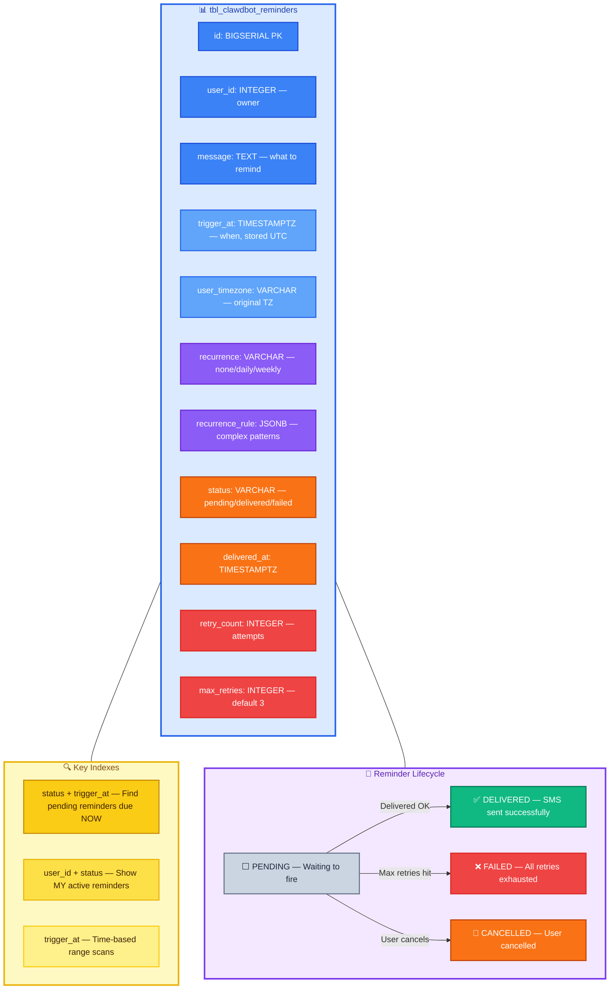

# Reminder Feature — Mermaid Flowcharts for Excalidraw

> **How to use:** Copy each mermaid code block (without the triple backticks) and paste into
> [Excalidraw Mermaid Tool](https://excalidraw.com) → Click "+" → "Mermaid" → Paste → Done.
>
> **Paste ONE diagram at a time** into Excalidraw for best results.

---

## DIAGRAM 0 — Prerequisite: Peppi Outbound SMS API

---

## DIAGRAM A — Upstash QStash Flow ⭐ RECOMMENDED

```mermaid
flowchart TD
    subgraph QSTASH_INFO["💡 What is Upstash QStash?"]
        QI["Serverless HTTP message scheduler by Upstash — same vendor as our Redis. You schedule an HTTP request to hit your endpoint at a future time. QStash handles waiting + retrying. ✅ No background workers ✅ Free: 500 msgs/day ✅ Pro: $1/100K msgs ✅ 99.99% SLA ✅ Built-in retry ✅ Native CRON"]
    end

    subgraph P1["📨 PHASE 1 — User Creates Reminder"]
        A["👤 User SMS: Remind me tomorrow at 2pm to buy milk"]
        B["📱 Peppi Platform — Receives SMS"]
        C["🟢 FastAPI — POST /execute-action"]
        D{"🟣 AI Agent — Detects reminder intent"}
    end

    subgraph P2["💾 PHASE 2 — Store + Schedule"]
        E["🔴 Save to Supabase tbl_clawdbot_reminders — user_id: 123, message: Buy milk, trigger_at: 2026-02-18T14:00, status: pending"]
        F["🟠 Call QStash API — POST qstash.upstash.io/v2/publish — Header: Upstash-Not-Before: timestamp — Dest: /api/v1/reminders/deliver"]
        G["⏳ QStash holds message — No process on OUR side — Zero resource cost while waiting"]
        H["✅ Reply to user: Reminder set for tomorrow at 2:00 PM"]
    end

    subgraph P3["🚀 PHASE 3 — Delivery (hours later)"]
        I["🟠 QStash fires at EXACT scheduled time — POST /api/v1/reminders/deliver — Includes crypto signature"]
        J["🔐 Verify QStash signature — Prevents spoofed calls"]
        K["🟢 Fetch reminder from DB — Confirm still pending"]
        L["📱 Call Peppi SMS API — POST /api/send-message — user_id: 123, msg: Buy milk!"]
        M["🔴 Update DB — status = delivered, delivered_at = NOW()"]
        N["📩 User receives SMS: Reminder: Buy milk!"]
    end

    subgraph RETRY["🔄 If Delivery Fails"]
        R1["❌ Peppi API error or timeout"]
        R2["🟠 QStash auto-retries — 3 attempts, exponential backoff — No code needed!"]
        R3["💀 After max retries: status = failed, retry_count = 3"]
    end

    A -->|"1. SMS"| B
    B -->|"2. Forward"| C
    C -->|"3. To agent"| D
    D -->|"4. Intent matched"| E
    E -->|"5. Stored in DB"| F
    F -->|"6. Scheduled"| G
    E -->|"7. Confirm"| H

    G -->|"8. Time reached"| I
    I -->|"9. Webhook"| J
    J -->|"10. Valid"| K
    K -->|"11. Still pending"| L
    L -->|"12. Sent"| M
    M -->|"13. Done"| N

    L -->|"Error"| R1
    R1 --> R2
    R2 -->|"All failed"| R3

    style QSTASH_INFO fill:#FEF9C3,stroke:#EAB308,color:#854D0E,stroke-width:3px
    style QI fill:#FDE68A,stroke:#CA8A04,color:#422006,stroke-width:2px

    style P1 fill:#DBEAFE,stroke:#2563EB,color:#1E40AF,stroke-width:2px
    style A fill:#3B82F6,stroke:#1D4ED8,color:#FFF,stroke-width:2px
    style B fill:#60A5FA,stroke:#2563EB,color:#FFF,stroke-width:2px
    style C fill:#10B981,stroke:#047857,color:#FFF,stroke-width:2px
    style D fill:#8B5CF6,stroke:#6D28D9,color:#FFF,stroke-width:2px

    style P2 fill:#D1FAE5,stroke:#059669,color:#065F46,stroke-width:2px
    style E fill:#F43F5E,stroke:#BE123C,color:#FFF,stroke-width:2px
    style F fill:#F97316,stroke:#C2410C,color:#FFF,stroke-width:2px
    style G fill:#FDBA74,stroke:#EA580C,color:#7C2D12,stroke-width:2px
    style H fill:#4ADE80,stroke:#16A34A,color:#052E16,stroke-width:2px

    style P3 fill:#F3E8FF,stroke:#7C3AED,color:#5B21B6,stroke-width:2px
    style I fill:#F97316,stroke:#C2410C,color:#FFF,stroke-width:2px
    style J fill:#FACC15,stroke:#CA8A04,color:#422006,stroke-width:2px
    style K fill:#10B981,stroke:#047857,color:#FFF,stroke-width:2px
    style L fill:#3B82F6,stroke:#1D4ED8,color:#FFF,stroke-width:2px
    style M fill:#F43F5E,stroke:#BE123C,color:#FFF,stroke-width:2px
    style N fill:#8B5CF6,stroke:#6D28D9,color:#FFF,stroke-width:2px

    style RETRY fill:#FEE2E2,stroke:#EF4444,color:#991B1B,stroke-width:2px
    style R1 fill:#EF4444,stroke:#DC2626,color:#FFF,stroke-width:2px
    style R2 fill:#F97316,stroke:#C2410C,color:#FFF,stroke-width:2px
    style R3 fill:#DC2626,stroke:#991B1B,color:#FFF,stroke-width:2px
```

---

## DIAGRAM A2 — QStash Recurring Reminders

---

## DIAGRAM B — Render Cron + Supabase Polling (Fallback)

---

## DIAGRAM C — APScheduler Background Worker (Not Recommended)

---

## DIAGRAM D — Google Calendar Webhooks (Not Recommended)

---

## DIAGRAM E — Side-by-Side Comparison

---

## DIAGRAM F — Implementation Phases Timeline

```mermaid
flowchart LR
    subgraph W1["📦 Week 1: Foundation"]
        W1A["Create reminders table in Supabase"]
        W1B["Add CRUD endpoints in FastAPI"]
        W1C["Confirm Peppi outbound API"]
        W1D["Update AI agent reminder intent skill"]
    end

    subgraph W2["⚙️ Week 2: Scheduling"]
        W2A["Integrate chosen scheduling engine"]
        W2B["Build delivery endpoint"]
        W2C["Implement retry logic"]
        W2D["Timezone conversion: user local to UTC"]
    end

    subgraph W3["🔁 Week 3: Recurring"]
        W3A["Add recurrence: daily/weekly/monthly"]
        W3B["Next occurrence calculation"]
        W3C["User commands: show/cancel reminders"]
        W3D["Edge cases: DST transitions"]
    end

    subgraph W4["🔍 Week 4: Polish"]
        W4A["Delivery tracking in audit log"]
        W4B["Reminder management: list/cancel all"]
        W4C["Failure alerts: Slack/email to ops"]
        W4D["Load testing multi-tenant"]
    end

    W1 --> W2 --> W3 --> W4

    style W1 fill:#DBEAFE,stroke:#2563EB,color:#1E40AF,stroke-width:3px
    style W1A fill:#3B82F6,stroke:#1D4ED8,color:#FFF,stroke-width:2px
    style W1B fill:#60A5FA,stroke:#2563EB,color:#FFF,stroke-width:2px
    style W1C fill:#93C5FD,stroke:#3B82F6,color:#1E3A5F,stroke-width:2px
    style W1D fill:#BFDBFE,stroke:#60A5FA,color:#1E3A5F,stroke-width:2px

    style W2 fill:#D1FAE5,stroke:#059669,color:#065F46,stroke-width:3px
    style W2A fill:#10B981,stroke:#047857,color:#FFF,stroke-width:2px
    style W2B fill:#34D399,stroke:#059669,color:#FFF,stroke-width:2px
    style W2C fill:#6EE7B7,stroke:#10B981,color:#064E3B,stroke-width:2px
    style W2D fill:#A7F3D0,stroke:#34D399,color:#064E3B,stroke-width:2px

    style W3 fill:#F3E8FF,stroke:#7C3AED,color:#5B21B6,stroke-width:3px
    style W3A fill:#8B5CF6,stroke:#6D28D9,color:#FFF,stroke-width:2px
    style W3B fill:#A78BFA,stroke:#7C3AED,color:#FFF,stroke-width:2px
    style W3C fill:#C4B5FD,stroke:#8B5CF6,color:#3B0764,stroke-width:2px
    style W3D fill:#DDD6FE,stroke:#A78BFA,color:#3B0764,stroke-width:2px

    style W4 fill:#FFF7ED,stroke:#EA580C,color:#9A3412,stroke-width:3px
    style W4A fill:#F97316,stroke:#C2410C,color:#FFF,stroke-width:2px
    style W4B fill:#FB923C,stroke:#EA580C,color:#FFF,stroke-width:2px
    style W4C fill:#FDBA74,stroke:#F97316,color:#7C2D12,stroke-width:2px
    style W4D fill:#FED7AA,stroke:#FB923C,color:#7C2D12,stroke-width:2px
```

---

## DIAGRAM G — Data Model Overview

