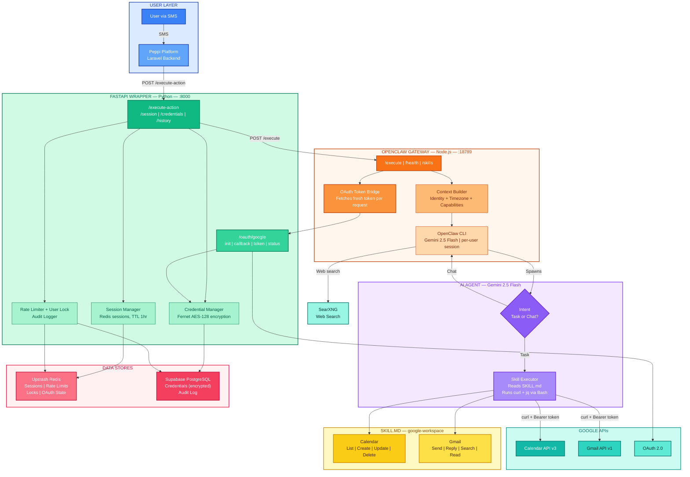
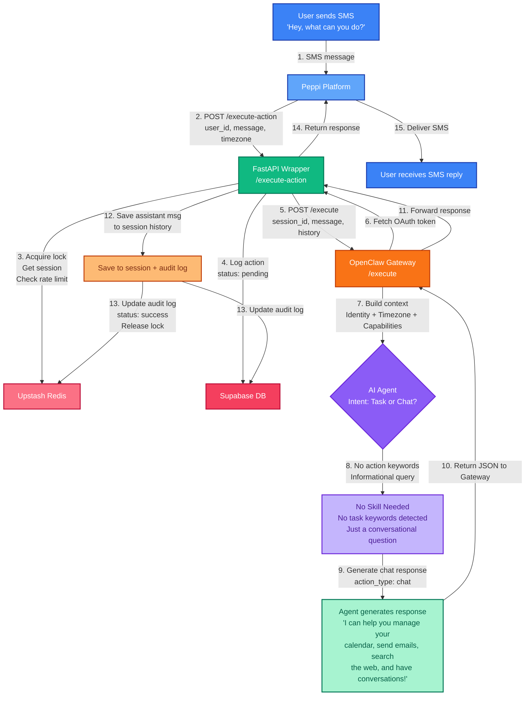
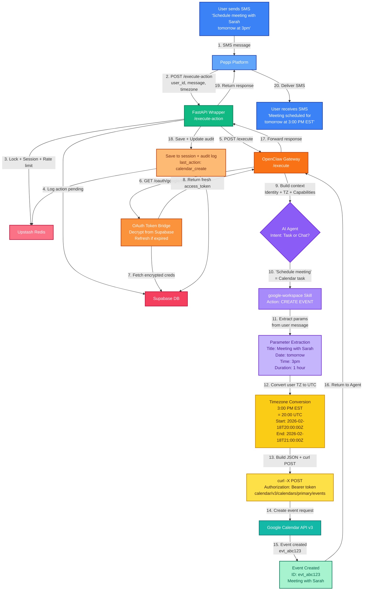
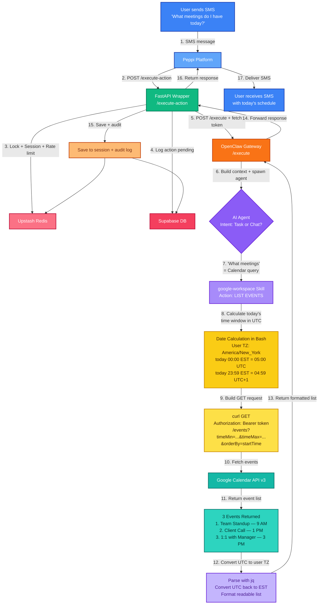
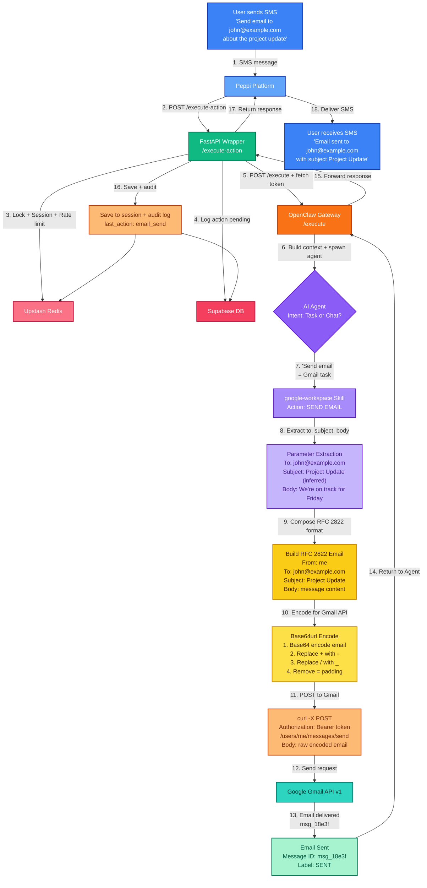
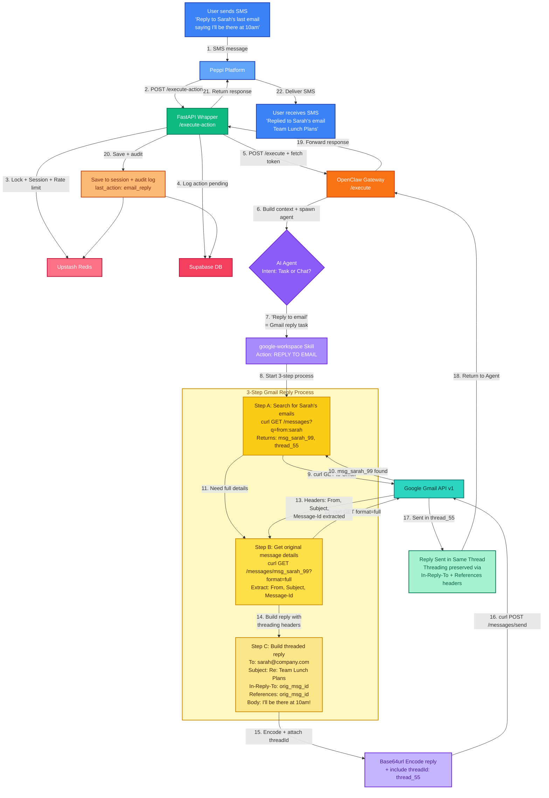
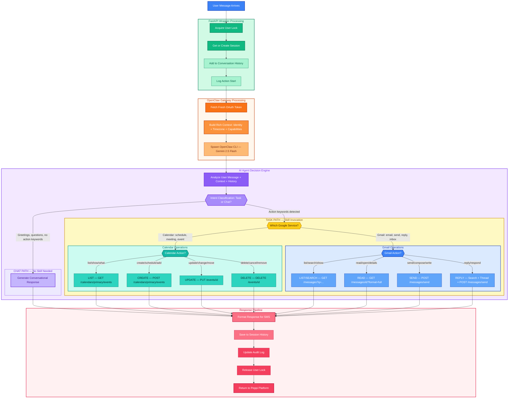
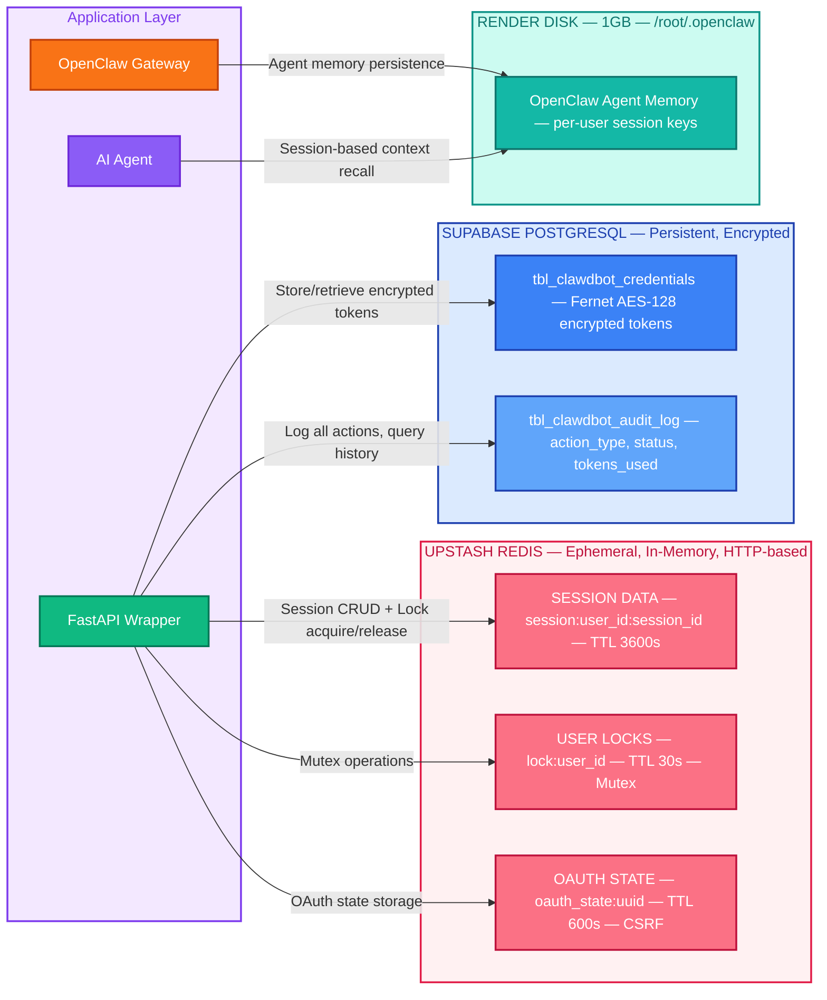

# Moltbot Architecture Diagrams (Mermaid)

> Paste each mermaid code block individually into Excalidraw's Mermaid import feature.

---

## 1. BASE ARCHITECTURE OVERVIEW — Full System Map

---

## 2. SCENARIO: Simple Chat — No Task, Just Conversation

---

## 3. SCENARIO: Create Calendar Event

---

## 4. SCENARIO: Query Calendar Events — "What's on my schedule today?"

---

## 5. SCENARIO: Send a New Email

---

## 6. SCENARIO: Reply to an Email (Threaded)

---

## 7. SCENARIO: Google OAuth Connection Flow

```mermaid
flowchart TB
    subgraph PHASE1["PHASE 1 — Initiate OAuth"]
        direction TB
        USER_CLICK["User clicks\n'Connect Google Account'\non Peppi Website"]
        INIT["FastAPI: /oauth/google/init\nGenerate CSRF state token\nstate = random UUID"]
        STORE_STATE["Store state in Redis\noauth_state:uuid TTL=600s\nuser_id + redirect_uri"]
        AUTH_URL["Build Google Auth URL\nclient_id + redirect_uri\nscope: calendar + gmail\naccess_type: offline"]
        REDIRECT["Redirect user to\nGoogle Consent Screen"]
    end

    subgraph PHASE2["PHASE 2 — User Consent"]
        direction TB
        CONSENT["Google shows:\n'Moltbot wants access to\nyour Calendar and Gmail.\nAllow?'"]
        ALLOW["User clicks Allow"]
        AUTH_CODE["Google generates\nauthorization code"]
        CALLBACK["Google redirects to\n/oauth/google/callback\n?code=AUTH_CODE&state=csrf"]
    end

    subgraph PHASE3["PHASE 3 — Token Exchange"]
        direction TB
        VALIDATE["FastAPI validates CSRF state\nGET oauth_state from Redis\nDEL after validation"]
        EXCHANGE["POST to oauth2.googleapis.com/token\ncode + client_id + client_secret\ngrant_type: authorization_code"]
        TOKENS["Google returns tokens\naccess_token: ya29.xxx\nrefresh_token: 1//xxx\nexpires_in: 3600"]
    end

    subgraph PHASE4["PHASE 4 — Store Credentials"]
        direction TB
        ENCRYPT["Encrypt with Fernet AES-128\nFernet.encrypt(json.dumps(\naccess_token + refresh_token))"]
        STORE_DB["UPSERT tbl_clawdbot_credentials\nuser_id=123, service=google\nencrypted_credentials, expires_at"]
        SUCCESS["Redirect to Peppi website\nstatus=success\n'Google Account Connected!'"]
    end

    subgraph PHASE5["PHASE 5 — Token Usage (Later)"]
        direction TB
        GW_REQUEST["Gateway needs token\nGET /oauth/google/token/123"]
        FETCH_CREDS["Fetch from Supabase\nDecrypt with Fernet"]
        CHECK{"Token\nexpired?"}
        USE_TOKEN["Return fresh\naccess_token to Gateway"]
        REFRESH["POST to Google\ngrant_type: refresh_token\nGet new access_token\nUpdate Supabase"]
    end

    REDIS["Upstash Redis"]
    SUPA["Supabase DB"]
    GOOGLE["Google OAuth 2.0"]

    USER_CLICK -->|"1. Click connect"| INIT
    INIT -->|"2. Store CSRF state"| STORE_STATE
    STORE_STATE -->|"3."| REDIS
    INIT -->|"4. Build URL"| AUTH_URL
    AUTH_URL -->|"5. Redirect"| REDIRECT
    REDIRECT -->|"6. User sees consent"| CONSENT
    CONSENT --> ALLOW
    ALLOW -->|"7. User approves"| AUTH_CODE
    AUTH_CODE -->|"8. Callback with code"| CALLBACK
    CALLBACK -->|"9. Validate state"| VALIDATE
    VALIDATE -->|"10. Check Redis"| REDIS
    VALIDATE -->|"11. Exchange code"| EXCHANGE
    EXCHANGE -->|"12. POST to Google"| GOOGLE
    GOOGLE -->|"13. Return tokens"| TOKENS
    TOKENS -->|"14. Encrypt tokens"| ENCRYPT
    ENCRYPT -->|"15. Store encrypted"| STORE_DB
    STORE_DB -->|"16."| SUPA
    STORE_DB -->|"17. Redirect success"| SUCCESS

    GW_REQUEST -->|"18. Fetch creds"| FETCH_CREDS
    FETCH_CREDS -->|"19."| SUPA
    FETCH_CREDS -->|"20. Check expiry"| CHECK
    CHECK -->|"Not expired"| USE_TOKEN
    CHECK -->|"Expired"| REFRESH
    REFRESH -->|"21. Refresh token"| GOOGLE
    REFRESH -->|"22. Update DB"| SUPA
    REFRESH -->|"23. Return new token"| USE_TOKEN

    style PHASE1 fill:#DBEAFE,stroke:#1E40AF,color:#1E40AF,stroke-width:2px
    style USER_CLICK fill:#3B82F6,stroke:#1E40AF,color:#FFF,stroke-width:2px
    style INIT fill:#10B981,stroke:#047857,color:#FFF,stroke-width:2px
    style STORE_STATE fill:#A7F3D0,stroke:#047857,color:#065F46,stroke-width:2px
    style AUTH_URL fill:#34D399,stroke:#047857,color:#FFF,stroke-width:2px
    style REDIRECT fill:#60A5FA,stroke:#1E40AF,color:#FFF,stroke-width:2px

    style PHASE2 fill:#F3E8FF,stroke:#7C3AED,color:#7C3AED,stroke-width:2px
    style CONSENT fill:#8B5CF6,stroke:#6D28D9,color:#FFF,stroke-width:2px
    style ALLOW fill:#A78BFA,stroke:#6D28D9,color:#FFF,stroke-width:2px
    style AUTH_CODE fill:#C4B5FD,stroke:#6D28D9,color:#4C1D95,stroke-width:2px
    style CALLBACK fill:#10B981,stroke:#047857,color:#FFF,stroke-width:2px

    style PHASE3 fill:#FFF7ED,stroke:#C2410C,color:#C2410C,stroke-width:2px
    style VALIDATE fill:#F97316,stroke:#C2410C,color:#FFF,stroke-width:2px
    style EXCHANGE fill:#FB923C,stroke:#C2410C,color:#FFF,stroke-width:2px
    style TOKENS fill:#FDBA74,stroke:#C2410C,color:#7C2D12,stroke-width:2px

    style PHASE4 fill:#FEF9C3,stroke:#CA8A04,color:#854D0E,stroke-width:2px
    style ENCRYPT fill:#FACC15,stroke:#CA8A04,color:#422006,stroke-width:2px
    style STORE_DB fill:#FDE047,stroke:#CA8A04,color:#422006,stroke-width:2px
    style SUCCESS fill:#A7F3D0,stroke:#047857,color:#065F46,stroke-width:2px

    style PHASE5 fill:#D1FAE5,stroke:#047857,color:#047857,stroke-width:2px
    style GW_REQUEST fill:#F97316,stroke:#C2410C,color:#FFF,stroke-width:2px
    style FETCH_CREDS fill:#10B981,stroke:#047857,color:#FFF,stroke-width:2px
    style CHECK fill:#8B5CF6,stroke:#6D28D9,color:#FFF,stroke-width:2px
    style USE_TOKEN fill:#A7F3D0,stroke:#047857,color:#065F46,stroke-width:2px
    style REFRESH fill:#FB7185,stroke:#BE123C,color:#FFF,stroke-width:2px

    style REDIS fill:#FB7185,stroke:#BE123C,color:#FFF,stroke-width:2px
    style SUPA fill:#F43F5E,stroke:#BE123C,color:#FFF,stroke-width:2px
    style GOOGLE fill:#14B8A6,stroke:#0F766E,color:#FFF,stroke-width:2px
```

---

## 8. SCENARIO: Agent Decision Flow — Task vs Chat

---

## 9. SCENARIO: Data Store Interactions — What Lives Where

---

## HOW TO USE IN EXCALIDRAW

1. Go to **excalidraw.com**
2. Click the **hamburger menu** (top-left)
3. Select **"Mermaid to Excalidraw"** (or press the Mermaid icon in the toolbar)
4. **Paste ONE diagram at a time** from the code blocks above
5. Click **"Insert into Canvas"**
6. Arrange and style each diagram on your canvas
7. Repeat for each scenario

Each diagram is self-contained and can be imported independently.
