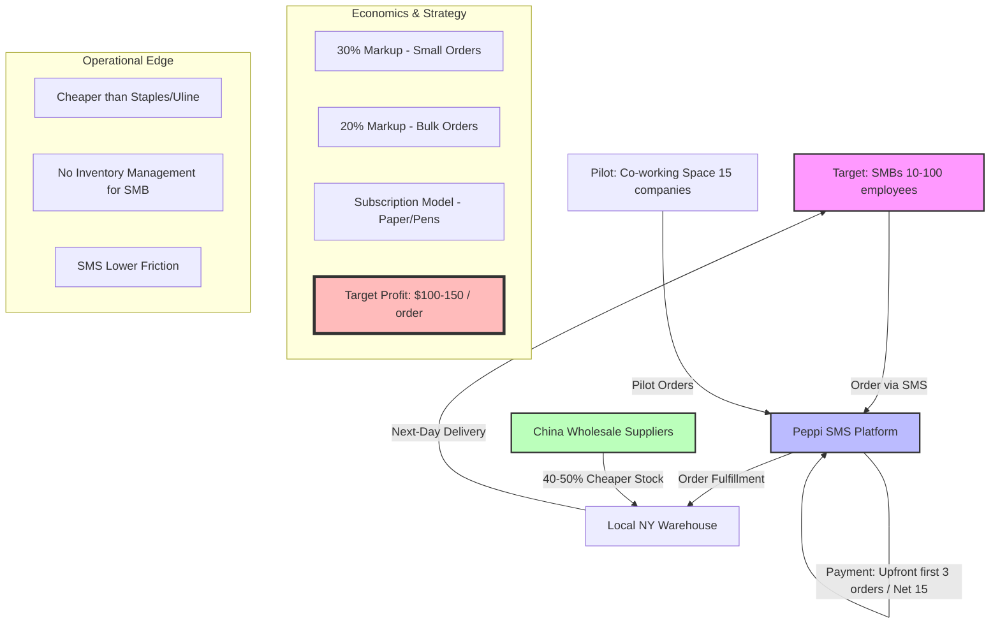

# Peppi B2B Dropshipping: Deal Visualization

This visualization captures the business model and deal lifecycle for **Peppi**, a B2B office supply dropshipping startup targeting SMBs in New York.

## Mermaid Diagram (Excalidraw Compatible)

## Business Deal Summary
- **Average Order Value**: $500 - $800.
- **Net Profit**: $100 - $150 per order.
- **Revenue Model**: Tiered markups + Subscription revenue for recurring supplies.
- **Growth Strategy**: Pilot with co-working spaces, then scale through direct outreach to office managers.
